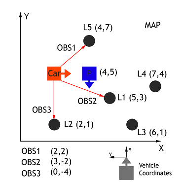

# Kidnapped Vehicle Project

Udacity's Self-Driving Car Engineer Nanodegree Program

---
In this project, two dimensional particle filter was implemented in C++ to localize a kidnapped vehicle for a given-map. 
The particle filter is given a map and some initial localization information (analogous to what a GPS would provide). 
During the run-time, at each time step the filter also gets observation and control data from the [Term 2 simulator](https://github.com/udacity/self-driving-car-sim/releases).

---
### Project Dependencies

* cmake >= 3.5
  * All OSes: [click here for installation instructions](https://cmake.org/install/)
* make >= 4.1 (Linux, Mac), 3.81 (Windows)
  * Linux: make is installed by default on most Linux distros
  * Mac: [install Xcode command line tools to get make](https://developer.apple.com/xcode/features/)
  * Windows: [Click here for installation instructions](http://gnuwin32.sourceforge.net/packages/make.htm)
* gcc/g++ >= 5.4
  * Linux: gcc / g++ is installed by default on most Linux distros
  * Mac: same deal as make - [install Xcode command line tools](https://developer.apple.com/xcode/features/)
  * Windows: recommend using [MinGW](http://www.mingw.org/)
* boost.test => 1.45 (optional)
* uWebSocket (https://github.com/uNetworking/uWebSockets)

---
### Running the Code

1. Clone this repo.
2. Create a build directory: `mkdir build && cd build`
3. Compile: `cmake .. && make` 
   * On windows, you may need to run: `cmake .. -G "Unix Makefiles" && make`
4. Run it: `./particle_filter `

After built and run `./particle_filter`, the Udacity's [Term 2 simulator](https://github.com/udacity/self-driving-car-sim/releases) needs to be run to see how the particle filter works. 
`particle_filter` application connects to the simulator through [uWebSocket](https://github.com/uNetworking/uWebSockets) to exchange a sensor data.

---
## Particle Filter (Localization) Algorithm

Basically, the particle filter was implemented as shown in the figure below.


## 1. Initialization

The most practical way to initialize our particles and generate real time output, is to make an initial estimate using GPS input. As with all sensor based operations, this step is impacted by noise.
So it takes accounting for Gaussian noise. It also is important to note that particles are initialized in global map coordinate.

## 2. Predict step
Using the motion model (bycicle model), we predict where the vehicle will be at the next time step, by updating based on yaw rate and velocity, while accounting for Gaussian sensor noise.
Yaw angle is heading direction of a car. It is measured from x-axis in the map coordinate (sometimes called global coordinate). In the figure below, yaw (theta) is equal to `pi/4`.


To predict the motion, we use below equations by assuming that a yaw (turn) rate and velocity is constant.


## 3. Update step (Update weights)
We need to correctly perform observation measurement transformations, along with identifying measurement landmark associations in order to correctly calculate each particle's weight.
To update weight of each particle, the following steps are performed:

* __3.1. Transformation__ 

We first need to transform the car's measurements from its local car coordinate system to the map's coordinate system.



In the graph above we have a car (ground truth position) that observes three nearby landmarks, each one labeled OBS1, OBS2, OBS3. 
Each observation measurement has x, and y values in the car's coordinate system. We have a particle "P" (estimated position of the car) above with position (4,5) on the map with heading -90 degrees. 
The first task is to transform each observation marker from the vehicle's coordinates to the map's coordinates, with respect to our particle.

This transformation are carried out for all observations using below equations of homogenous transformation.


Observations in the car coordinate system can be transformed into map coordinates (*Xm* and *Ym*) by passing car observation coordinates (*Xc* and *Yc*), map particle coordinates (*Xp* and *Yp*), 
and our rotation angle (-90 degrees for above example) through a homogenous transformation matrix. This homogenous transformation matrix, shown below, performs rotation and translation.

* __3.2. Filter landmarks__

After the observation measurements are transformed to global map coordinate system, landmarks are filtered based on a given sensor range of particles. It means that we considers only landmarks withing range of sensors for next computations.

* __3.3. Data assocation__

Each measurement will need to be associated with a landmark identifier, for this part we take the closest landmark to each transformed observation using the nearest neighbor algorithm.

* __3.4. Update weights__

The particles final weight will be calculated as the product of each measurement's Multivariate-Gaussian probability density.
The Multivariate-Gaussian probability density has two dimensions, x and y. 
The mean of the Multivariate-Gaussian is the measurement's associated landmark position and the Multivariate-Gaussian's standard deviation is described by our initial uncertainty in the x and y ranges. 
The Multivariate-Gaussian is evaluated at the point of the transformed measurement's position. The formula for the Multivariate-Gaussian can be seen below.


Updating weights have 2 substeps: 
* Determine measurement probabilities by calculating weight for each observation with multivariate Gaussian.
* Combine probabilities by product of all observation weight with total observations weight.

## 4. Resampling

For this project, the Wheel approach was implemented to resample particles. Its pseudocode is like this:

```
index = random[1...N]
beta = 0

for i=1...N
	beta = beta + random{0...2*max(w)}
	
	while w[index] < beta:
		beta = beta - w[index]
		index = index + 1

	select p[index]
```

## Project Output

Generally, what I observed from results is that error decreases when number of particles increases. On the other hand, indeed the system time also increases due to increase of number of particles.

__Number of particles: 100__


__Number of particles: 200__


__Number of particles: 500__

